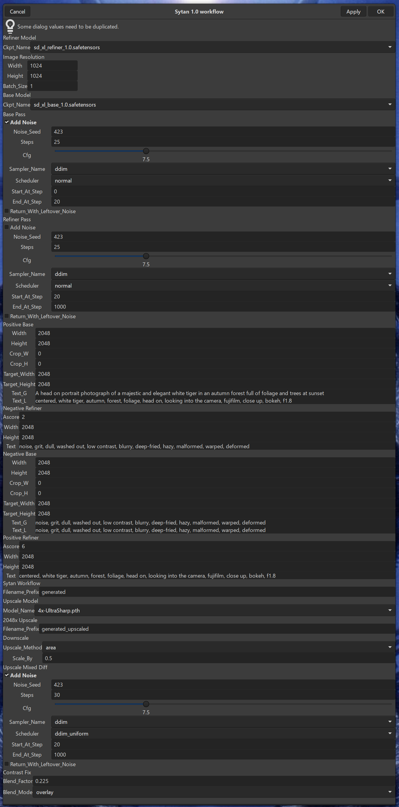
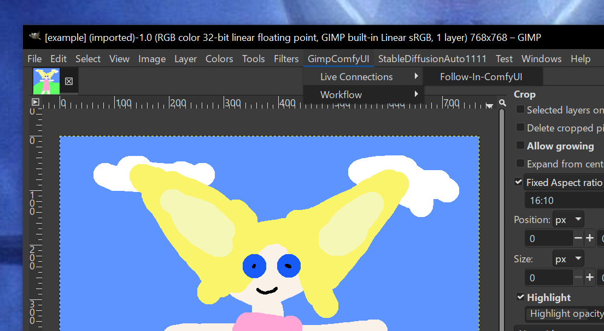
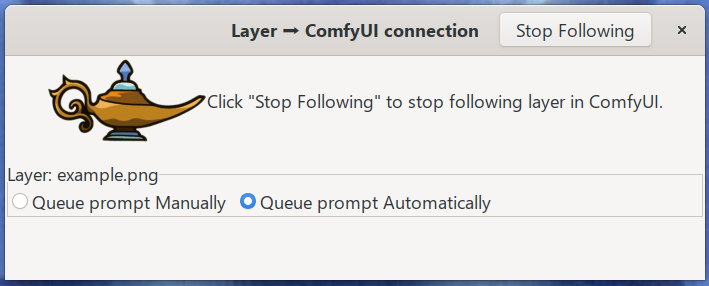

# Welcome to GimpComfyUI

**GimpComfyUI** is a GIMP plugin to connect near-realtime image editing to AI image generation via ComfyUI's web api.
It enables Gimp to connect directly to ComfyUI, and optionally send a layer
as an image as you edit it. This plugin is targeted for Gimp 3.0, which is not yet released, but 
is scheduled for release in 2024. The current development and testing platform is Gimp 2.99+

NOTE: This project is an unstable alpha version, and Gimp 3 is also pre-release. Your Mileage May Vary.

# Prerequisites and Dependencies
- Gimp 2.99.18+ development release, or Gimp 3.0.x when it becomes available.
- Python 3.1x.x to run the "installer". This could be the same python used to run ComfyUI, or the python built into
- Gimp, but a standalone full python is preferred. Anyway, it should be on your terminal's PATH when you run the installer, or you should know the full path to the python executable.
- Access to ComfyUI via a stable URL. The preferred scenario is that the latest stable version of ComfyUI is installed on your local host.
- To install ImageTransceiver-ComfyUI, you will need write access to ComfyUI's "custom_nodes" folder.
- You can optionally clone the ImageTransceiver-ComfyUI project. See "Cloning" below.
- Have ComfyUI running and reachable when you use this plugin! The plugin checks connectivity whenever you invoke a 
procedure. **If GimpComfyUI cannot connect to ComfyUI, it will fail, and the only indication will be in the logs**.


ComfyUI's API is very workflow dependent. Any Gimp plug-in for ComfyUI will basically only work for a particular
api-style workflow and its nodes. Installing 3rd party nodes and workflows is currently out-of-scope of this project,
but the following workflows are available as assets in the "./assets" directory:
- comfyui_default_workflow
- comfyui_default_workflow_api
- img2img_sdxl_0.3_workflow
- img2img_sdxl_0.3_workflow_api
- inpainting_sdxl_0.4_workflow
- inpainting_sdxl_0.4_workflow_api
- sytan_sdxl_1.0_workflow
- sytan_sdxl_1.0_workflow_api

# Cloning
It is not a good idea to clone or copy this entire repository into the plug-ins folder, because Gimp will read every
file, and try to evaluate each as plug-in content. This raises security and performance issues.

There is no need to clone the ImageTransceiver-ComfyUI project, but If you wish to review or modify the code of the 
ImageTransceiver-ComfyUI node, you can clone it into a local directory, and change the `COMFY_NODE_PROJ` URL in the 
installer.py script from a GitHub url to a local protocol url. For example, you can change:

`COMFY_NODE_PROJ: "https://github.com/Charlweed/image_transceiver`

to

`COMFY_NODE_PROJ: "file://L:/projects/comfyui_custom_nodes/image_transceiver"`

# Building
There is no need to build anything.

# Pre-Installation!
The Pythons included in versions of Gimp are subsets of a "full" python installation. This is very reasonable, but
inconvenient for GimpComfyUI. In particular, they are (often) missing the modules "websocket-client", and "requests-toolbelt".
Gimp pythons are also missing "pip", the tool to manage python modules. Finally, the python modules that *are* included
are often out-of-date, with bugs and security issues. All of these are addressed by the pre-installation steps.
You will need to either run the pre-install script for your system, or manually execute the script's commands in a shell
yourself. Sorry to say, you will need to understand full directory paths to files, and you must use a text editor and terminal.
If that's too technical for you, find some help to follow these instructions. You will only need to do this again if
you reinstall Gimp, or a Gimp update removes the python modules we are going to install.
## Windows
You will need to find the folder where GIMP-2.99 or GIMP-3.0 is installed. For most users, as of 2024, Sept 5, that is
"C:\Program Files\Gimp-2.99.18" but you might have it installed somewhere else, and the version may change. In
particular, if Gimp is installed as a "Per-User Application", you will find it under
"C:\Users\<your username>\AppData\Local\Programs".
Open the folders all the way down to &lt;bla&gt;\\&lt;bla&gt;\Gimp-?.??.??\bin, and find the python executable files. On Windows,
as of 2024, Sept 5, the file you are looking for is "python3.11", and the ".exe" on the end is probably hidden. "python3.11"
*might* be updated to something else, that's what you are trying to verify. Once you are certain of the complete directory
path to the exact filename, you are set to continue. If you don't know, it will probably look something like
"C:\Program Files\Gimp-2.99.18\bin\python3.11.exe" or
"C:\Users\<your username>\AppData\Local\Programs\Gimp-2.99.18\bin\python3.11.exe"


Now, you will need to edit the pre-install_windows.ps1 file, and change the lines near the top to the path you figured out above:
* $GIMP_PYTHON_3_11 = "C:\Program Files\Gimp-2.99.18\bin\python3.11.exe"
* $GIMP_PYTHON_3_11_BIN = "C:\Program Files\Gimp-2.99.18\bin"

Don't omit the quotes!

Now, open a terminal, and navigate to this repository. In this dir, run the command ".\pre-install_windows.ps1"
The pre-installer might print some optional instructions. You can now run the installer with Gimp's python, or your system's full python.
## Mac
You will need to find the folder where GIMP-2.99 or GIMP-3.0 is installed.
Right-Click on the Gimp-2.99 icon, and select "Open in finder". Then right-click "Show Package Contents". Open the
folders down to Contents\MacOS, and find the python executable files. On Mac, as of 2024, Sept 6, the file you are
looking for is "python3.10". "python3.10" might be (hopefully has!) be updated to something else, that's what you are
trying to verify. Once you are certain of complete directory path to the exact filename, you are set to continue. If you
don't know, it will look something like "/Applications/GIMP.app/Contents/MacOS/python3.10". While right-clicking the
python-executable, you can hold down the clover/option key, and select "Copy &lt;bla&gt; as Pathname".

Now, you will need to edit the pre-install_windows.ps1 file, and change the lines near the top to the path you figured out above:
* export GIMP_PYTHON_3_10="/Applications/GIMP.app/Contents/MacOS/python3.10"
* export GIMP_PYTHON_3_10_HOME="/Applications/GIMP.app/Contents/MacOS"

Now you need to find the GIMP_PYTHON_3_10_BIN directory. As of 2024, Sept 5, it should be 
"/Applications/GIMP.app/Contents/Resources/Library/Frameworks/Python.framework/Versions/3.10/bin" 
but you should check this, and verify that "bin" contains files like "normalizer" "python3.10" and "wheel".
Once verified, you can right-click the "bin" folder, hold down the clover/option key, and select "Copy bin as Pathname".
Paste it as the value:
* export GIMP_PYTHON_3_10_BIN="/Applications/GIMP.app/Contents/Resources/Library/Frameworks/Python.framework/Versions/3.10/bin"

Don't omit the quotes!

Now, open a terminal, and navigate to this repository. In this dir, run the command "./pre-install_macos.sh"
The pre-installer might print some optional instructions. You can now run the installer with Gimp's python, or your system's full python.

# Installation
This project includes a rudimentary installer. It has these basic functions:
- Configure the foundational JSON files with data about your GIMP, StableDiffusion, and ComfyUI setups.
- Copy the Gimp plugin to the Gimp user's "plug-ins" folder.
- Download, extract, and copy the ComfyUI custom node to a specified folder.

The basic config data may be specified from the command line, or a TK GUI, if a GUI is available in your Python. For 
destinations, You might first choose any reasonable destinations, and then later manually move the files from there into
final folders yourself.

The installer.py script is in the root of this project directory. It is best launched from the command line, and has
"optional" options: "--gimp_scripts_dir" "--stable_diffusion_data_dir" and "--comfyui_custom_nodes_dir". If you do not 
use these options, the installer will try to open a TK directory chooser. Failing that, the installer will prompt you 
type in both values. **If you don't launch the installer from the command line, and your python cannot access TK, the 
installer will seem to silently fail**.

For Gimp 2.99, the plug-ins is folders are platform-dependent, for example:
`~/AppData/Roaming/Gimp/2.99/plug-ins/Gimp-comfyui` or `~/.config/Gimp/2.99/plug-ins/Gimp-comfyui`. For ComfyUI, the
custom node files and folders belong in `<some-parent-path>/ComfyUI/custom_nodes`. The custom node for ComfyUI
is only required for real-time image manipulation. But if you don't install it, you will miss out on a really cool
feature.😄

## Installation steps
Assuming Gimp 2.99 and ComfyUI are installed and working:
1) Locate or choose your Gimp 2.99/3.0 Gimp installation, and find `bin/python` in that Gimp installation.
2) Locate or choose your Gimp plugins-folder. The folder in your home folder is the simplest choice:
`~/AppData/Roaming/Gimp/2.99/plug-ins` for Windows, or `~/.config/Gimp/2.99/plug-ins` on linux, `"~/Library/Application Support/GIMP/2.99/plug-ins"` on MacOS. Replace the ~ with your home directory.
3) Locate your ComfyUI folder, and find the `custom_nodes` folder in it.
4) Locate or choose your StableDiffusion data folder, which is the parent dir to `models`. Typically, this will be 
`ComfyUI`, the same as above, but does not need to be. **It must have a "models" directory, so create that if you are using a
temporary or dummy directory.**
5) Locate, or choose, an install-time python installation. You can choose the python bundled with Gimp, as discussed 
above in Pre-Installation, but Gimp's python does not have TK installed, so you will need to use the command line 
interface. **Installing TK in Gimp's python does not work, at least not of this writing in 2024/07/31**
6) In a terminal/console, execute ``<your-python> <this-project>/installer.py`` if you are providing command-line 
options, put each directory name in quotes, to avoid problems with spaces.

If a dialog opens:
7) Choose your account's Gimp plug-in folder, i.e. ``~/AppData/Roaming/Gimp/2.99/plug-ins`` and click "Ok"
8) Choose the ComfyUI custom_nodes folder, i.e. ``~/projects/3rd_party/ComfyUI/custom_nodes`` and click "Ok"
Even if you do not have a local ComfyUI installed, pick an existing directory, perhaps the temp directory. Otherwise, 
the installer will stop before installing the Gimp plug-in. The Pre-Installation scripts create example temporary 
directories, and prints their location.
9) Choose your StableDiffusion data folder, i.e. `L:/data/stable_diffusion`, or `~/projects/3rd_party/ComfyUI` 
and click "Ok". Again, even if you do not have StableDiffusion nor ComfyUI installed, pick an existing directory.

If a dialog does not open:
7) At the prompt `Please provide an existing directory path for gimp_scripts_dir`, enter your account's Gimp plug-in folder, i.e. ``~/AppData/Roaming/Gimp/2.99/plug-ins`` and press "return"
8) At the prompt `Please provide an existing directory path for comfyui_custom_nodes_dir`, enter the ComfyUI custom_nodes folder, i.e. ``~/projects/3rd_party/ComfyUI/custom_nodes`` and press "return"
9) At the prompt `Please provide an existing directory path for stable_diffusion_data_dir`, enter your StableDiffusion data folder, i.e. `L:/data/stable_diffusion`, or `~/projects/3rd_party/ComfyUI` and press "return"

Installation will proceed and finish.

# After Installation
- On macOS and Linux, **the plug-in and custom node will silently fail if they are not executable.** Ensure the execute 
bit is set on each .py file by running  
`find <plug-in-dir> -iname '*.py' -exec chmod -v a+x {} \;` and
`find <custom-nodes-dir>/image_transceiver -iname '*.py' -exec chmod -v a+x {} \; `
- *Permanently* set the environment variable "STABLE_DIFF_PREF_ROOT" to the parent of your StableDiffusion "models" 
directory. Typically, this will be `<bla-bla>/ComfyUI`, but if you have relocated stuff, you can configure that here. 
If the environment variable STABLE_DIFF_PREF_ROOT is unset, the plugin will use (and create child directories in!) 
"&lt;USERHOME&gt;/data/stable_diffusion/", which is probably not what you want, if you have a local stable diffusion.
The procedure for permanently setting environment variables for your system is out-of-scope of this document.
- Restart ComfyUI, read the logs, and ensure that the Custom node(s) were loaded correctly.
- Restart Gimp, and you will see a GimpComfyUI menu item.
- Configure connection properties via `GimpComfyUI ➳ Config` and set the ComfyUI API connection URL
-- (`http://localhost:8188/` by default) and the ImageTransceiver connection URL (`http://localhost:8765/` by default)


# Usage
Before starting Gimp, start the ComfyUI server.  The plugin checks connectivity whenever you invoke a procedure. **If 
GimpComfyUI cannot connect to ComfyUI, it will fail, and the only indication will be in the logs.** To monitor the 
progress of ComfyUI, it is best to start it in Console mode. This also allows you to watch the console to ensure there 
are no errors.  NOTE: If you are running your own ComfyUI, but on a different host then "localhost", then you need to 
start ComfyUI with the additional option `--listen 0.0.0.0`, otherwise ComfyUI will reject connections from your Gimp 
clients. After starting, the console or logs should show that image_transceiver was loaded. You should see text that
looks like:
```commandline
Import times for custom nodes:
   0.0 seconds: L:\projects\3rd_party\ComfyUI\custom_nodes\image_transceiver
```
There might be additional logging that looks like:
```
[image_transceiver.py:153 -       server_control() ] server_control; Operation ServerOperation.START
```
## ComfyUI
 See the README for the [ImageTransceiver-ComfyUI project](https://github.com/Charlweed/image_transceiver) for
 details on setting-up ComfyUI for live img2img from Gimp.
## Gimp
Start Gimp 2.99.18+ development release, or Gimp 3.0.x.
### Workflow Coupling
Workflow coupling allows you to use a ComfyUI directly from Gimp via settings in Gimp dialogs. It is for situations
where you have a set workflow, and all you want to change are the values for the inputs of that workflow. For example,
this is what the dialog for [Sytan's SDXL workflow](https://github.com/SytanSD/Sytan-SDXL-ComfyUI) looks like in Gimp:




If you edit the values in the dialog, then click "Apply", ComfyUI will run the workflow, and (eventually) the final
images will open directly within Gimp. If you click "Ok", the dialog will close, and the workflow will run. 
Note that it can take quite a few seconds, even minutes, to run a workflow. You can track the progress in the console
of ComfyUI. 
#### Additional Workflows
Adding a new ConfyUI workflow to couple to Gimp requires some computing and python 3 skills. You need  to complete the
dialog that Gimp opens for the workflow. The difficulty depends upon the size and complexity of the workflow, and the
datatypes that workflow processes.
[Read more here](./adding_workflows.md)


### Live Connections➳Follow-In-ComfyUI
ImageTransceiver-ComfyUI is a custom node that enables Gimp to connect directly to ComfyUI, and send a layer as an image
as you edit it. For best initial results, choose a modestly sized image. Here, we use the 764x764 sketch from 
the img2img ComfyUI demo, so you can see how your painting changes the final results.
You should see the GimpComfyUI menu at the top of the Gimp Window. Insure your main image layer is selected, then
navigate the menus to "GimpComfyUI" ➳ "Live Connections" ➳ "Follow-in-ComfyUI"


A daemon dialog will appear. Select the radio button "Queue prompt Automatically":


Now, you can paint, draw, cut, spray, whatever, into that layer, and the changes will affect what ComfyUI
generates. Sometimes your manipulations will yield exactly what you might expect, often they will not.  All the
prompt-crafting issues are in play, but lower "denoise" strengthens how much the Gimp image comes through to the final
image.

# Known Issues
The python web-socket library on Windows is inexplicably slow, especially for localhost. The dialogs might take seconds
to open on even on the fastest PCs with 64gb RAM, and dozens of processors. You can run ComfyUI on your PC, connect to it 
via your LAN with a Mac (or Linux), and everything will be 4-8 times faster than localhost on the PC. There is no 
available fix as of 2024/08/24. 

# Troubleshooting
- Verify that whatever plugin folder you are using (~/.config/Gimp/2.99/plug-ins) is listed in the Gimp's plug-ins 
- folders. (`Edit➳Preferences➳Folders➳Plug-Ins`)

# Contributing

This is unsupported alpha software, but if you see a problem, or opportunities for improvement, please open an issue and
make a pull request. For example, the pre-installation steps should be eliminated, but that would require lots of
platform specific scripting, eliminating the module dependencies with custom code, or both.

# License

[MIT](LICENSE)
